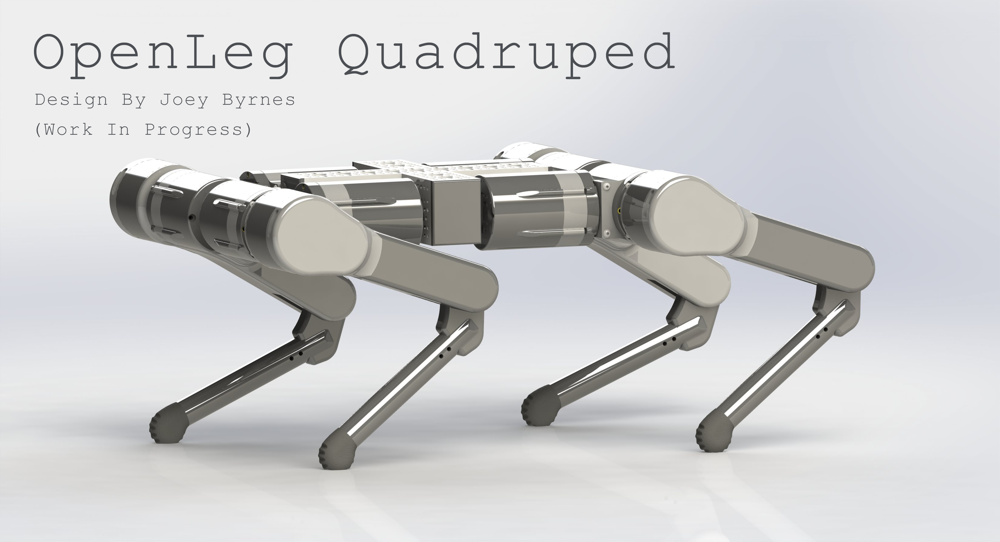
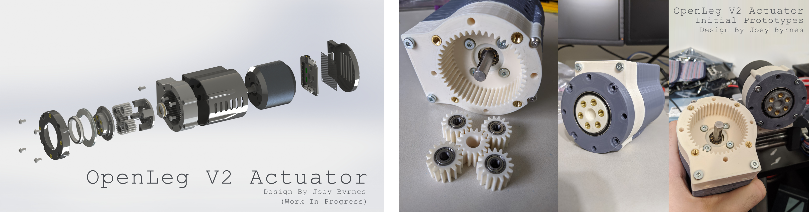

  

OpenLeg started as my Senior Design project for ECE445 at UIUC. The goal of the project is to provide a fully open source robotic leg capable of fast dynamic movements for research and development of quadrupedal robots. OpenLeg is intended to make development of robotic legs and associated algorithms accessible to hobbyists and researchers with tight schedules or budgets. 

All files required for replicating OpenLeg V1 are provided along with an assembly guide. All crucial mechanical and electrical assembly is now documented in the assembly guide. 

Feel free to reach out to me at openlegproject@gmail.com if you are interested in building the leg or contributing to the project.

Please keep in mind- OpenLeg isn't a finished product, it's still very much under development. You can expect everything in the assembly guide to be ready to use but for things not listed in the guide you should expect that there is still development needed to be done.

You can find the OpenLeg V1 Senior Design demo video here: https://www.youtube.com/watch?v=aXOSeKpADnk

OpenLeg has also been featured on the following sites: 
<a href="https://hackaday.com/2019/09/21/openleg-the-open-source-robot-leg/" target="_blank">Hackaday</a> &nbsp;&bull;&nbsp;
<a href="https://www.hackster.io/news/you-can-design-your-own-sophisticated-walking-robot-thanks-to-this-student-project-7c02dde19ade" target="_blank">Hackster</a>&nbsp;&bull;&nbsp;
<a href="https://www.inceptivemind.com/openleg-open-source-project-building-robot-legs/9271/" target="_blank">InceptiveMind</a>&nbsp;&bull;&nbsp;
<a href="https://asgardia.space/en/news/You-Can-Design-Your-Own-Four-Legged-Robot-Without-Designing-Its-Legs-Now" target="_blank">Asgardia</a>

  

I've had to put OpenLeg on pause for quite some time now for both personal and work reasons but I wanted to post an update to assure everyone following the project that the development is still very much ongoing and there's a lot of exciting improvements to look forward to with OpenLeg V2 and the OpenLeg Quadruped.

OpenLeg V2 is no longer just a standalone 2 DOF leg, it's a full 3 DOF leg speificaly optimized for use in the OpenLeg Quadruped. 

OpenLeg V2 is based on a modular actuator with a 50Kv motor, planetary gearbox, and FOC controller all built into one unit. This actuator is used for both of the hip joints, while the knee uses a belt transmission for keeping a nice form factor. The belt transmission has however been updated to have far lower friction that the 90 degree twist design in OpenLeg V1.

  

  

  

  

  

