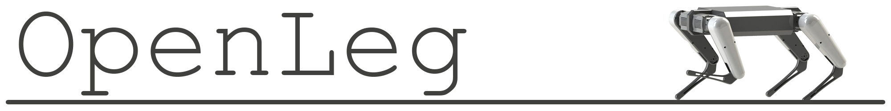
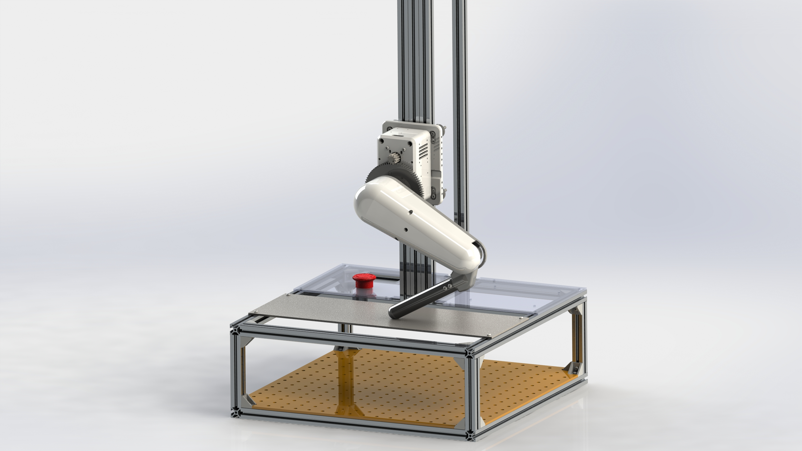

  

OpenLeg started as my Senior Design project for ECE445 at UIUC. The goal of the project is to provide a fully open source robotic leg capable of fast dynamic movements for research and development of quadrupedal robots. OpenLeg is intended to make development of robotic legs and associated algorithms accessible to hobbyists and researchers with tight schedules or budgets. 

All files required for replicating OpenLeg are provided along with an assembly guide. I'm working on getting new content up every day. All crucial mechanical and electrical assembly is now documented in the assembly guide. A few small things are missing and will be added soon.

Please reach out to me at openlegproject@gmail.com if you are interested in building the leg or contributing to the project.

Please keep in mind- OpenLeg isn't a finished product, it's still very much under development. You can expect everything in the assembly guide to be ready to use but for things not listed in the guide you should expect that there is still development needed to be done.

Thanks to my Senior Design partners Kanyon Edvall and Ahsan Qureshi for helping realize much of the project in the tight schedule of just one semester. Watch our Senior Design demo video here: https://www.youtube.com/watch?v=aXOSeKpADnk 

  

  

